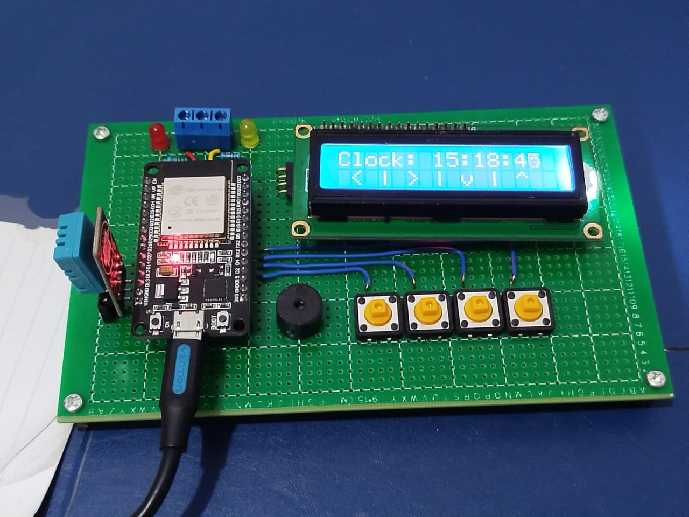
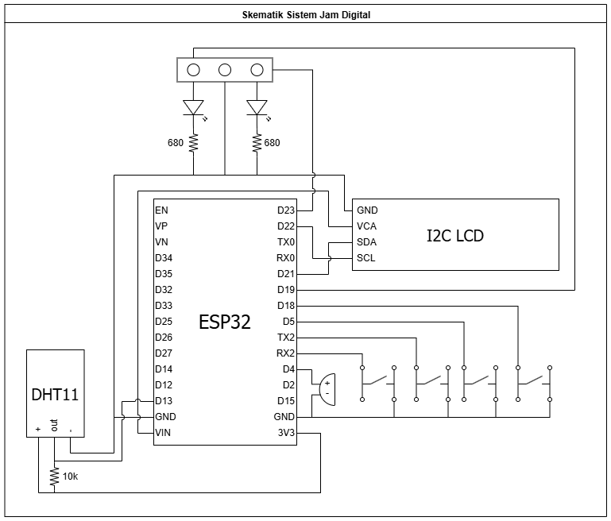

This repository is for the firmware of an ESP32-RTOS based Digital Clock-Alarm-Timer system equipped with buzzer and DHT11 moisture/temperature sensor.

The buttons are implemented with clicks and holds function. The clicks are used for changing parameter, while the holds are used for switching pages and modes.

Below is the preview example of the Digital Clock circuit:

This circuit uses schematic below with pins defined in "PinDefine.h":

Instruction for simple installation:
1. Use arduino IDE and make sure the workbench directory is set up.
2. Adjust the WiFi SSID and Password used for fetching time data in "Variables.h".
3. Adjust the TIME_ZONE macro for your respective time zone in "Variables.h".
4. Compile and upload the code to your board and have fun!